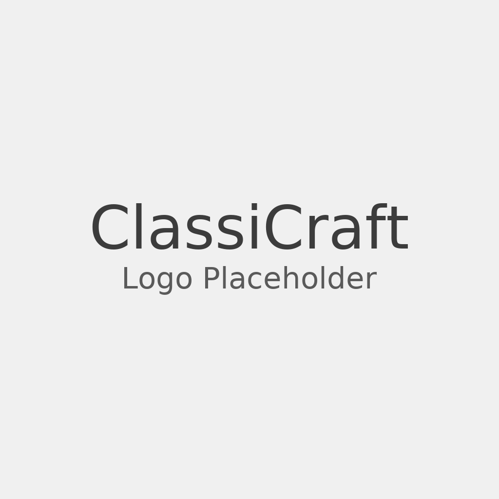

# 
# ClassiCraft

**ClassiCraft** is a community-driven Survival SMP with light MMO mechanics, town systems, and seasonal events.  
We focus on **player freedom, progression, and collaboration** — blending the classic Minecraft survival feel with modern community and roleplay features.

---

## 🌍 Server Identity

ClassiCraft is built around these core values:
- **Community-first gameplay** → Towny nations, player-run shops, and shared progression.
- **Balanced progression** → Custom economy, prestige ranks, and skill trees that add depth without creating pay-to-win barriers.
- **Optional MMO elements** → Skills, light dungeons, and events for those who want more challenge.
- **Creative world-building** → Aether-inspired floating islands, custom ores, dungeons, and seasonal events.
- **Inclusive and fun** → Pride events, community-driven content, and optional roleplay support.

---

## 🛠️ Features

- 🏰 **Towns & Nations** with TownyAdvanced  
- 💰 **Custom economy** with player auctions, prestige ranks, and admin shops funded by progression  
- ⚔️ **Skills & Progression** with ValhallaMMO & Origins  
- 🎉 **Seasonal Events & Dungeons** for optional challenges  
- 🌍 **Custom World Generation** (Aether islands, custom ores, vertical travel islands)  
- 🎨 **Cosmetics & Achievements** (DiscordSRV, BlazeAndCave Advancements, FromTheFog integration)  

---

## 🏗️ Organization

ClassiCraft is developed and maintained as a **GitHub organization** with dedicated repositories for each server environment:

- **Prod** → The live player server.  
- **Staging** → The testing ground for new features.  
- **S3** → The development server for the upcoming season.  

We use **GitHub Projects** to track our roadmap and changelogs.  
- 📌 [Roadmap & Issues](../../projects)  
- 📰 [Changelog](../../releases)

---

## 🔗 Important Links

- 🎮 **IP Address**: `play.classicraft.org`  
- 🗺️ **Map**: [map.classicraft.org](https://map.classicraft.org)  
- 🌐 **Website**: [classicraft.org](https://classicraft.org)  
- 💬 **Discord**: [Join the Community](https://discord.gg/classicraft)  
- ❤️ **Support the Server**: [Donation Store](https://store.classicraft.org)  

---

## 🚀 Join Us

Start your adventure today and become part of the **ClassiCraft community**.  
Whether you’re here to build a town, grind progression, or dive into seasonal events — there’s a place for you in ClassiCraft!
